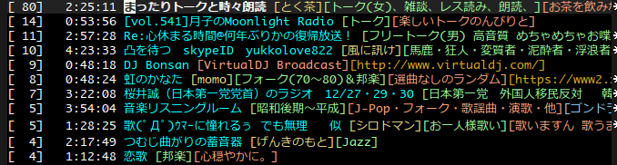

# netoraji
Netoraji(ねとらじ) client for Emacs

## 概要
ねとらじヘッドライン取得＆視聴が出来るEmacsメジャーモードです。MPlayerとs.elが必要です。

## スクリーンショット
 

## インストール＆起動
netoraji.elをロードパスの通ったディレクトリに配置し、(require 'netoraji)を評価します。M-x netoraji とすることで起動します。

## キーバインディング
